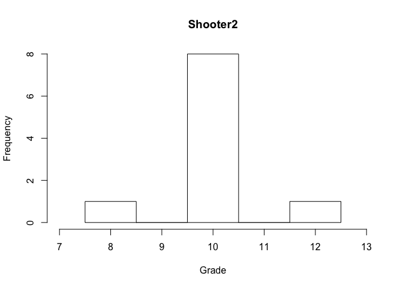
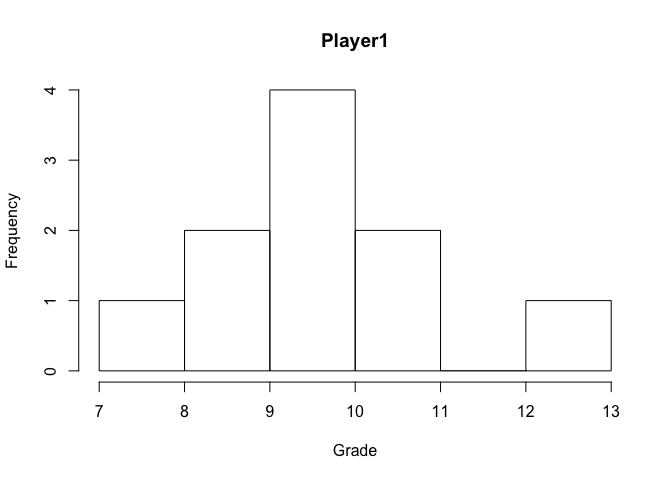
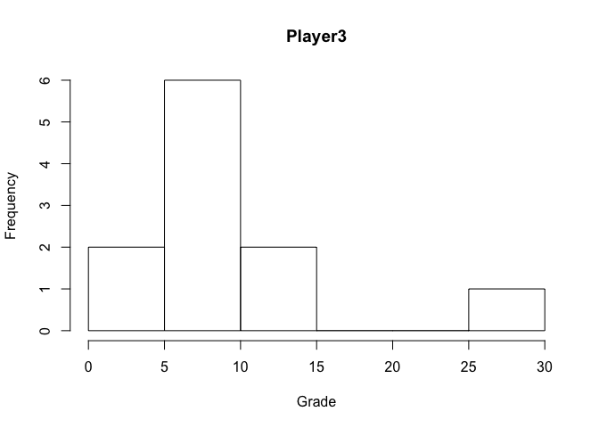

HF Statistics 3
================

# 3장. 변이와 분포 측정하기

## 범위와 변화량 분석

특정 데이터에 대한 평균을 확인함으로써 그 데이터의 중심을 측정할 수 있지만, 평균값은 데이터가 분포되어 있는 방식에 대해 아무런
정보도 제공하지 않기 때문에 다른 방법이 필요합니다.

여러분이 농구감독이라고 가정해봅시다. 철수, 민재, 영호 세 선수 중 어떤 선수를 선발해야 할까요.

p.125

``` r
chul <- c(7,8,9,9,10,10,11,11,12,13)
min <- c(7,9,9,10,10,10,10,11,11,13)
young <- c(3,3,6,7,7,10,10,10,11,13,30)

chul
```

    ##  [1]  7  8  9  9 10 10 11 11 12 13

``` r
min
```

    ##  [1]  7  9  9 10 10 10 10 11 11 13

``` r
young
```

    ##  [1]  3  3  6  7  7 10 10 10 11 13 30

``` r
d <- data.frame( Mean = c(mean(chul), mean(min), mean(young)),
                 Median = c(median(chul), median(min), median(young)),
                 Mode = c(which.max(chul), which.max(chul), which.max(chul)))
d
```

    ##   Mean Median Mode
    ## 1   10     10   10
    ## 2   10     10   10
    ## 3   10     10   10

다음 두 후보 선수 중에 어떤 선수를 선발해야 할까요.

p.127

``` r
shooter1 <- c(8,9,9,10,10,10,11,11,12)
shooter2 <- c(8,10,10,10,10,10,10,10,10,12)

median(shooter1)
```

    ## [1] 10

``` r
mean(shooter1)
```

    ## [1] 10

``` r
range(shooter1)
```

    ## [1]  8 12

``` r
median(shooter2)
```

    ## [1] 10

``` r
mean(shooter2)
```

    ## [1] 10

``` r
range(shooter2)
```

    ## [1]  8 12

``` r
average.s1 = sum(shooter1) / length(shooter1)

average.s2 = sum(shooter2) / length(shooter2)


d <- data.frame(Average = c(average.s1, average.s2),
                Median = c(median(shooter1), median(shooter2)),
                Range = c(range(shooter1), range(shooter2)))

d
```

    ##   Average Median Range
    ## 1      10     10     8
    ## 2      10     10    12
    ## 3      10     10     8
    ## 4      10     10    12

``` r
length(range(shooter1))
```

    ## [1] 2

``` r
length(range(shooter2))
```

    ## [1] 2

함수설명 median함수는 중앙값

mean함수는 평균값

range함수는 두 값, 가장 큰 값(상한)과 가장 작은 값(하한)을 나타냅니다. length(range())

범위(range)는 데이터 값들의 분포 방식을 측정하는 방법으로, 데이터가 얼마나 많은 숫자 값을 포함하고 있는지 알려줍니다.
R의 range함수는 두 값, 가장 큰 값(상한)과 가장 작은 값(하한)을 나타냅니다.

보이는 바와 같이 평균값, 중간값, 범위가 동일합니다. 우리는 자료를 시각화하여 살펴볼 필요가 있습니다. \* 데이터 프레임이
같아서 시각화해야 한다.

``` r
shooter1 = c(8, 9,9, 10,10,10, 11,11, 12)
shooter2 = c(8, 10,10,10,10,10,10,10,10, 12)

hist_shooter1 <- hist(shooter1, xlab = "Grade", breaks = seq(7.5, 12.5),xlim = c(7,13), main = "Shooter1")
```

<!-- -->

``` r
hist_shooter1
```

    ## $breaks
    ## [1]  7.5  8.5  9.5 10.5 11.5 12.5
    ## 
    ## $counts
    ## [1] 1 2 3 2 1
    ## 
    ## $density
    ## [1] 0.1111111 0.2222222 0.3333333 0.2222222 0.1111111
    ## 
    ## $mids
    ## [1]  8  9 10 11 12
    ## 
    ## $xname
    ## [1] "shooter1"
    ## 
    ## $equidist
    ## [1] TRUE
    ## 
    ## attr(,"class")
    ## [1] "histogram"

``` r
hist_shooter2 <- hist(shooter2, xlab = "Grade", breaks = seq(7.5, 12.5),xlim = c(7,13), main = "Shooter2")
```

<!-- -->

``` r
hist_shooter2
```

    ## $breaks
    ## [1]  7.5  8.5  9.5 10.5 11.5 12.5
    ## 
    ## $counts
    ## [1] 1 0 8 0 1
    ## 
    ## $density
    ## [1] 0.1 0.0 0.8 0.0 0.1
    ## 
    ## $mids
    ## [1]  8  9 10 11 12
    ## 
    ## $xname
    ## [1] "shooter2"
    ## 
    ## $equidist
    ## [1] TRUE
    ## 
    ## attr(,"class")
    ## [1] "histogram"

범위는 데이터 집합의 분포를 간단하게 측정하는 방법이지만, *왜 간단한지 만약 데이터가 이상치에 로버스트하지 못합니다. *범위에
대한 설명, 통계학에서 말하는 것과 R에서의

데이터 전체의 범위를 측정하는 대신, 이상치를 포함하지 않는 부분적인 범위를 측정함으로써 이상치에서 멀어질 수 있습니다.
*이상치가 무엇인지, 중요한 이유, *이상치를 알면, 이상치가 아닐 때 증감이 있으면 미래도 예상이 된다.

백분위수 백분위수는 어떤 값들의 p%(퍼센트)가 이 값 혹은 더 작은 값을 갖고, (100-p)%가 이 값 혹은 더 큰 값을
갖도록 하는 값을 말합니다. 벤치마킹을 할 때 유용합니다. k번째 백분위수는 데이터를 k% 위치에서 분할합니다.

백분범위 백분범위는 사분범위와 비슷한 개념입니다. 두 개의 백분위수 사이에 존재하는 범위를 말합니다.

사분위수

\*가장 많은 50%를 계산하자, 이상치를 제외하

사분범위(IQR) 사분범위는 75번째 백분위수와 25번째 백분위수 사이의 차이를 말합니다.

  - 사분위 -\> 수능 예시 10분위수

하한 사분위수

상한 사분위수

p.135

상자수염 다이어그램 (상자그림 boxplot)

상자수염 다이어그램(혹은 상자그림)은 상자모양으로 **사분범위**를, 수염으로 상한과 하한의 **데이터 집합의 범위**를
보여줍니다. 사분범위 상자 안에 수직선으로 **중앙값**을 표시합니다. 상자그림은 동일한 차트 위에 여러 데이터
집합을 표시할 수 있어 데이터를 비교할 매우 유용합니다

데이터가 이상치를 포함하고 있으면 **수염의 길이**가 길어집니다. 다시 말해, 수염이 얼마나 긴지를 확인하면 **데이터의
편향도**를 알 수 있습니다. 또한, 상자그림이 좌우대칭이면 데이터 역시 좌우대칭이겠죠.

p.141

### 변이와 분포 측정하기

변이(variability)는 데이터 값이 얼마나 밀집해 있는지 혹은 퍼져 있는지를 나타내는 산포도(dispersion)를
나타냅니다. 변이를 측정하고고, 그 폭을 줄이고자 다양한 요인들을 분석하고, 변이가 있는 상황에서 결정을 내리는
등, 통계의 핵심에 변이가 있다고 할 수 있습니다.

변이를 측정하는 방법 중 하나는 각각의 값이 평균값으로부터 얼마나 멀리 떨어져 있는지, 분산(variance)으로 분포를 확인하는
것입니다. 분산은 **각 값의 평균과의 거리(편차)를 제곱하여 더하고**, 이를 \*\*데이터 개수 n(데이터 표본을 이용할 때는
n-1\*)으로 나눈 값\*\*을 말합니다. 여기서 우리는 거리를 양수로 만들기 위해 제곱을 합니다.

하지만 거리를 제곱한 값들이 분포되어 있는 모습을 머리 속으로 그려내기가 쉽지 않습니다. 분산을 더 직관적으로 파악하기 위해
우리는 분산에 제곱근을 씌운 **표준편차**를 사용합니다. 분산을 더 빠르게 계산하는 방법은 각 값의 제곱의 합을
데이터 개수 n만큼 나누고, 이 값에서 평균의 제곱을 빼는 것입니다.

p.154

``` r
player1 = c(7, 9,9, 10,10,10,10, 11,11, 13)
player2 = c(7, 8, 9,9, 10,10, 11,11, 12, 13)
player3 = c(3,3, 6, 7,7, 10,10,10, 11, 13, 30)

hist_p1 <- hist(player1, xlab= "Grade", main = "Player1")
```

<!-- -->

``` r
hist_p2 <- hist(player2, xlab= "Grade", main = "Player2")
```

<!-- -->

``` r
hist_p3 <- hist(player3, xlab= "Grade", main = "Player3")
```

<!-- -->

``` r
d <- data.frame(MEAN = c(mean(player1), mean(player2), mean(player3)),
                        SD = c(sd(player1), sd(player2), sd(player3)),
                        IQR = c(IQR(player1), IQR(player2), IQR(player3)),
                        MAD = c(mad(player1), mad(player2), mad(player3)))

rownames(d) <- c("player1", "player2", "player3")

d
```

    ##         MEAN       SD IQR    MAD
    ## player1   10 1.563472 1.5 1.4826
    ## player2   10 1.825742 2.0 1.4826
    ## player3   10 7.362065 4.0 4.4478

``` r
boxplot(player1, player2, player3, col="light pink", ylim = c(2, 15))
```

<!-- -->

`mad(데이터) 함수는 중위절대편차를 나타냅니다.`

### 표준점수(표준분포)

p.158
