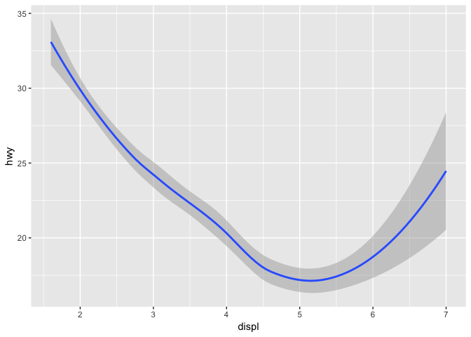

R for Data Science
================

이 글은 R for Data Science의 한글 번역서에서 찾아낸 오타 그리고 제가 생각하기 에 틀린 부분을 정리하고자 만드는
문서입니다. 우선 문서를 만들기 위해서 `tidyverse`를 가져오겠습니다.

``` r
library(tidyverse)
```

    ## Registered S3 methods overwritten by 'ggplot2':
    ##   method         from 
    ##   [.quosures     rlang
    ##   c.quosures     rlang
    ##   print.quosures rlang

    ## Registered S3 method overwritten by 'rvest':
    ##   method            from
    ##   read_xml.response xml2

    ## ─ Attaching packages ───────────────────────────────────────────────────────────────────────── tidyverse 1.2.1 ─

    ## ✔ ggplot2 3.1.1       ✔ purrr   0.3.2  
    ## ✔ tibble  2.1.1       ✔ dplyr   0.8.0.1
    ## ✔ tidyr   0.8.3       ✔ stringr 1.4.0  
    ## ✔ readr   1.3.1       ✔ forcats 0.4.0

    ## ─ Conflicts ─────────────────────────────────────────────────────────────────────────── tidyverse_conflicts() ─
    ## ✖ dplyr::filter() masks stats::filter()
    ## ✖ dplyr::lag()    masks stats::lag()

## 16쪽

`1.6 기하 객체` 아래에 있는 두 플롯 중 첫번째 것(즉 왼쪽 것)이 잘못 들어 갔습니다. 17쪽에 있는 코드를 보면 왼쪽
플롯을 그리는 코드는 다음과 같습니다. 다음과 같이 나와야 합니다.

``` r
ggplot(data = mpg) + 
    geom_point(mapping = aes(x =displ, y = hwy))
```

<!-- -->

오른쪽 플롯을 그린 코드는 다음과 같습니다. 이건 정확하게 나왔습니다.

``` r
ggplot(data = mpg) + 
    geom_smooth(mapping = aes(x =displ, y = hwy))
```

    ## `geom_smooth()` using method = 'loess' and formula 'y ~ x'

<!-- -->

이렇게 그리고 보면, 16쪽에 쓰여진 다음 문장이 정확하게 이해됩니다. 아래 문장에서 `지옴(geoms)`이라는 것은
`geom_smooth`과 `geom_point`을 말하는 것 같습니다.

> 두 플롯은 동일한 x 변수, 동일한 y 변수를 포함하고, 동일한 데이터를 나타낸다. 그러나 둘은 같지 않다. 각 플롯은
> 데이터를 표현하는 시각 객체가 다르다. ggplot2 문법으로는 두 플롯이 다른 지옴을 사용한다고 말한다.
