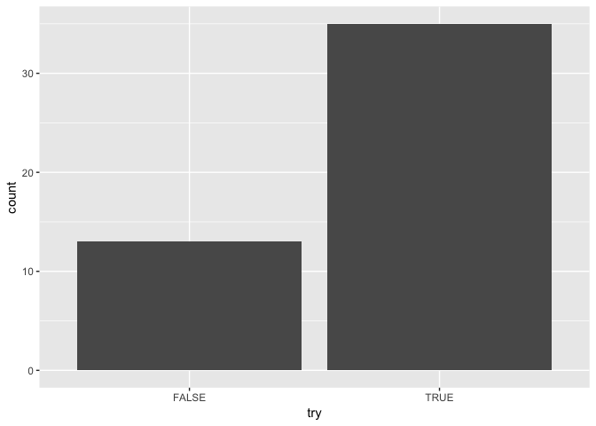
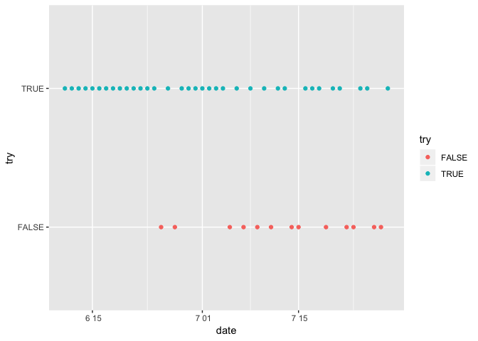

Pinenut Project
================

우선 라이브러리 셋팅을 한다.

``` r
library(tidyverse)
```

    ## Registered S3 methods overwritten by 'ggplot2':
    ##   method         from 
    ##   [.quosures     rlang
    ##   c.quosures     rlang
    ##   print.quosures rlang

    ## Registered S3 method overwritten by 'rvest':
    ##   method            from
    ##   read_xml.response xml2

    ## ─ Attaching packages ─────────────────────────────────── tidyverse 1.2.1 ─

    ## ✔ ggplot2 3.1.1       ✔ purrr   0.3.2  
    ## ✔ tibble  2.1.1       ✔ dplyr   0.8.0.1
    ## ✔ tidyr   0.8.3       ✔ stringr 1.4.0  
    ## ✔ readr   1.3.1       ✔ forcats 0.4.0

    ## ─ Conflicts ──────────────────────────────────── tidyverse_conflicts() ─
    ## ✖ dplyr::filter() masks stats::filter()
    ## ✖ dplyr::lag()    masks stats::lag()

다음으로 자료 입력을 한다. `read_csv()`을 이용한다. 날짜가 잘 안 들어 왔기 때문에 `parse_date()`을
이용하여 잘
조절한다.

``` r
pinenut.challenge <- read_csv("https://gist.githubusercontent.com/dialektike/a851a96238b4ae9baf57672a0d2ff0a1/raw/340310f11e92aef9e483431d07e8951cac2661c3/tae_woo.csv")
```

    ## Parsed with column specification:
    ## cols(
    ##   date = col_character(),
    ##   try = col_logical()
    ## )

``` r
pinenut.challenge ## 확인해 보면 날짜가 엉망이다.
```

    ## # A tibble: 48 x 2
    ##    date         try  
    ##    <chr>        <lgl>
    ##  1 2019. 6. 11. TRUE 
    ##  2 2019. 6. 12. TRUE 
    ##  3 2019. 6. 13. TRUE 
    ##  4 2019. 6. 14. TRUE 
    ##  5 2019. 6. 15. TRUE 
    ##  6 2019. 6. 16. TRUE 
    ##  7 2019. 6. 17. TRUE 
    ##  8 2019. 6. 18. TRUE 
    ##  9 2019. 6. 19. TRUE 
    ## 10 2019. 6. 20. TRUE 
    ## # … with 38 more rows

``` r
pinenut.challenge$date <- parse_date(pinenut.challenge$date, "%Y.%*%m.%*%d.")
pinenut.challenge # 고친 것을 확인한다.
```

    ## # A tibble: 48 x 2
    ##    date       try  
    ##    <date>     <lgl>
    ##  1 2019-06-11 TRUE 
    ##  2 2019-06-12 TRUE 
    ##  3 2019-06-13 TRUE 
    ##  4 2019-06-14 TRUE 
    ##  5 2019-06-15 TRUE 
    ##  6 2019-06-16 TRUE 
    ##  7 2019-06-17 TRUE 
    ##  8 2019-06-18 TRUE 
    ##  9 2019-06-19 TRUE 
    ## 10 2019-06-20 TRUE 
    ## # … with 38 more rows

True 와 False 를 살펴 본다. 생각보다 False 가 많다.

``` r
ggplot(data=pinenut.challenge) + stat_count(mapping=aes(x=try))
```

<!-- -->

날짜별로 그려보자\!

``` r
ggplot(pinenut.challenge, aes(date, try)) + geom_point(aes(color = try))
```

<!-- -->
